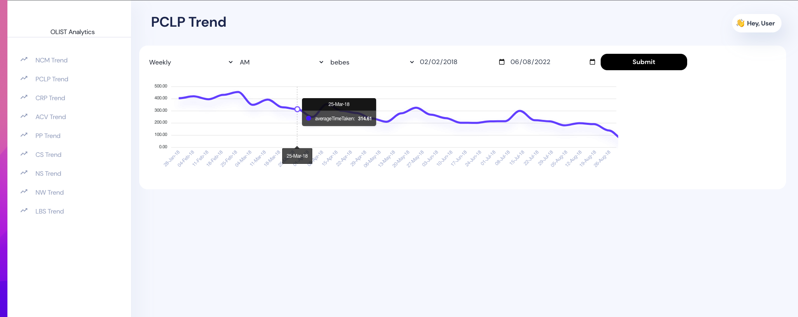
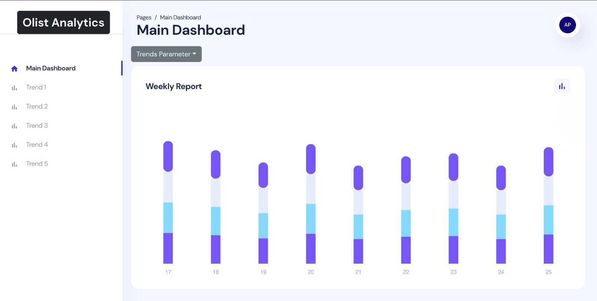

# olist-analytics-server
<<<<<<< HEAD
DBMS Olist Analytics Server Application
 
</img>
=======
DBMS Olist Analytics Server Application with UI
  
</img>
>>>>>>> 46912f15f730fc20379f0102f5dcd5af33432fb8

img